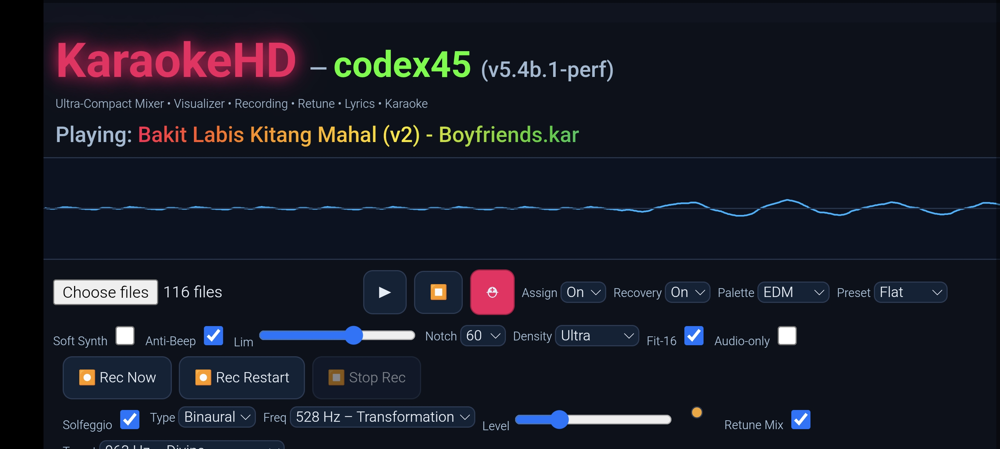
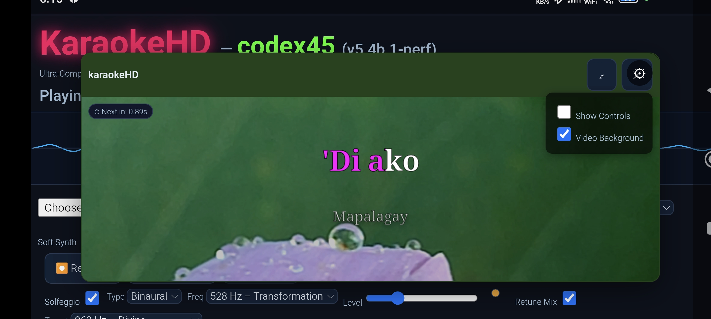
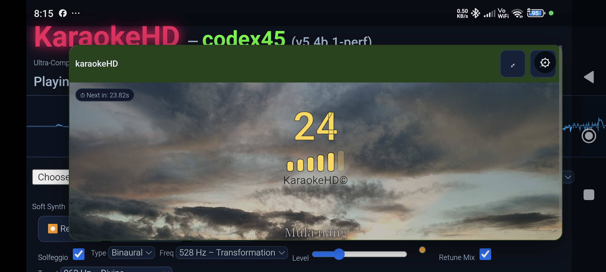
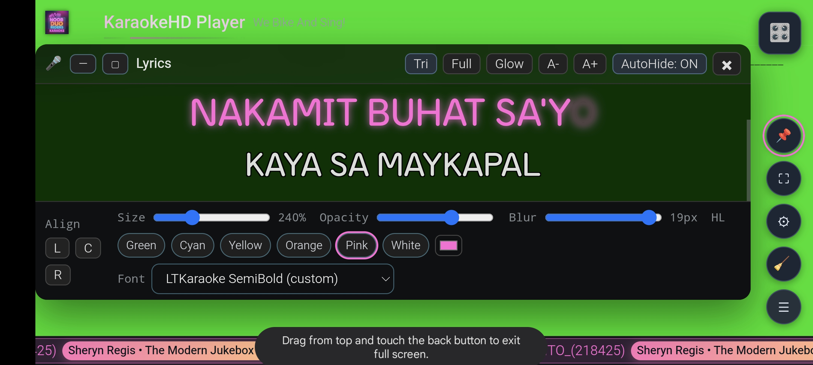
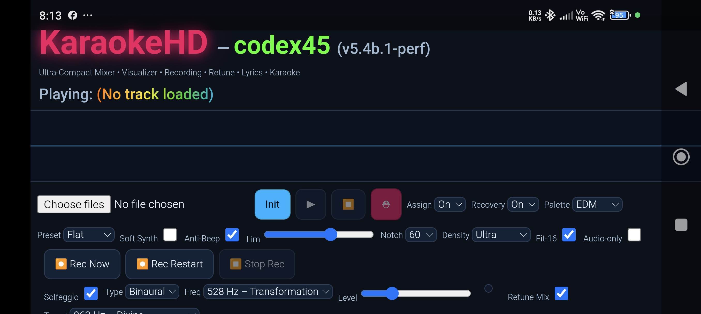

# 🎤 KaraokeHD

## 🔗 Live Demo

<p align="center">
  <a href="https://sempogi.github.io/KaraokeHd/index.html">
    
  </a>
</p>


**KaraokeHD** is a **standalone, serverless HTML application** that runs directly in any modern browser. It provides a full karaoke experience with MIDI/KAR playback, real-time lyrics rendering, and optional video backgrounds—all powered by pure HTML and inline JavaScript.

---

## ✅ Features

- **Serverless & Standalone**  
  Runs directly from your browser. No backend, no external dependencies.

- **MIDI/KAR Playback**  
  Parses MIDI files natively without using `midi.js` or any commercial libraries.

- **16 MIDI Channel Output**  
  Full support for 16-channel MIDI rendering.

- **Real Karaoke Display**  
  Smooth scrolling lyrics with active word highlighting.

- **Video Background Support**  
  Users can add their own videos as dynamic backgrounds.

- **Audio Recorder**  
  Converts MIDI playback to audio (acts like a MIDI-to-Audio converter).

- **Solfeggio Frequency Generator (Optional)**  
  Overlay standalone tracks for healing frequencies, mixable per channel.

- **Offline Ready**  
  Download and use locally without internet access.

---

## 📸 Screenshots

>Actual Screenshots
### Main Interface


### Karaoke Display


### Recorder Feature


### Video Background Support


### more


### more


---

## 📂 Folder Structure

```plaintext
KaraokeHD/
│
├── index.html          # Main application file
├── assets/             # Place screenshots and optional images 
└── README.md           # Project documentation
```

---

## ⚠️ Important Notes

- **No SoundFonts Included**  
  Users must provide their own MIDI files, fonts, and videos.

- **No Copyrighted Media**  
  This project does **not** include any copyrighted MIDI files, videos, or soundfonts.

- **Pure & Raw Code**  
  No commercial plugins, no `midi.js`. Everything is custom-built.

- **Non-Commercial Use**  
  You may use this project for personal purposes. **Commercial use requires my consent.**

---

## 🔊 Audio Quality Disclaimer

This version was originally designed as a **healing frequency generator**, so sound quality differs from previous builds that used SoundFonts as the sound engine. Overall audio is acceptable but not intended for professional-grade music production.

---

## 📂 How to Use

1. **Clone or Download** this repository.
2. Open `index.html` in any modern browser.
3. Provide your own:
   - MIDI/KAR files
   - Background videos
   - Fonts
4. Enjoy karaoke playback with optional Solfeggio frequency overlays.

---

## 🛠 Tech Stack

- **HTML5**
- **Inline JavaScript**
- **Web Audio API**
- **Canvas for Lyrics Rendering**

---

## 🚫 License & Restrictions

- **Free for Personal Use**
- **Commercial Use Requires Consent**
- **Do Not Redistribute with Copyrighted Media**

---

## 🌟 Why KaraokeHD?

- No installation required.
- No server dependencies.
- Pure browser-based karaoke experience.
- Healing frequency integration for wellness enthusiasts.
